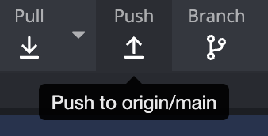

예전부터 GitKraken을 애용하고 있다.   
개발 처음 배울 때부터 오징어와 함께해서.. 지금까지 못 놓고 사용하고 있다.   

오징어를 사용하다보면, 가끔 이런 일이 발생한다.

*GitKraken에서 push할 때 무조건 origin/main로 보이는 현상*

새로운 브랜치를 push하려고 해도, 자꾸 `origin/main` 으로 push되는 문제이다.

침착하게 기억을 더듬어서 `git push origin/sample-branch sample-branch` 라고 입력해도
```bash
fatal: 'origin/sample-branch' does not appear to be a git repository
fatal: Could not read from remote repository.
```
이러한 오류가 발생한다.

모종의 이유로 origin 이 꼬인 상태기 때문에 remote 주소를 새로 연결하면 된다.

```bash
git remote remove origin
git remote add origin {Git 주소}
git remote -v

```   
   
예전에 동료분이 이거 어떻게 고치는지 아냐고 물어봤었는데.. 이젠 말해줄 수 있다! ㅋㅋ


