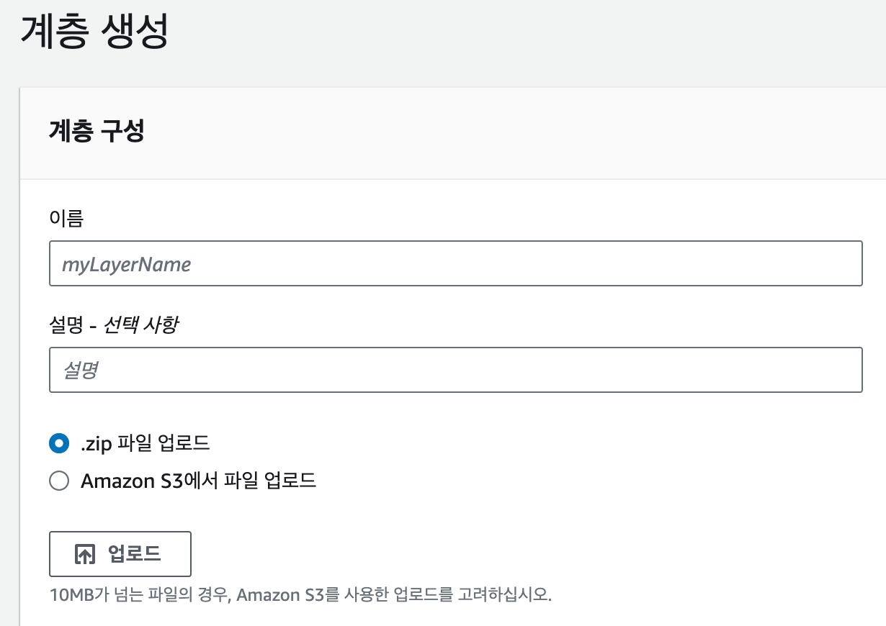
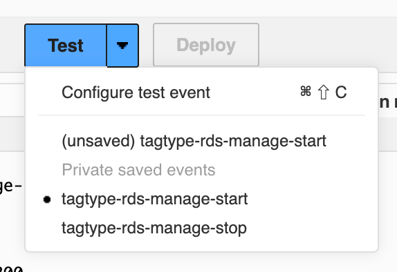

## 문제 상황

사이드프로젝트 용으로 AWS RDS `db.t3.micro`를 사용하고 있다.


사프용으로 사용해보니, 다음과 같은 단점들이 있었다.

1. **불필요한 비용이 많이 든다.**
   - 30d \* 24 hr 으로 책정되어 불필요한 과금
   - 평소에 작업할 때 말고는 사용하지 않기 때문에 사용하지 않을 때는 일시정지 처리가 필요하다.
2. 직접 일시정지 상태로 처리하면 DB는 일주일만 일시정지가 유지된다.
   - 완전히 삭제하는게 아닌 이상, 일주일이 지나면 다시 활성화 돼서 비용이 부과된다.
   - 그리고 켜서 작업하다가 끄는 걸 깜빡한다면? 계속 비용이 부과된다.
3. 개발자는 나뿐이라, 같이 작업하는 친구들이 DB를 활성화해야한다면 나를 통해 요청해야한다.
   - 어 좀 귀찮은데..? 웹페이지에서 처리 못하나?

<br />
<br />

## 해결책

1. 불필요한 비용이 많이 든다. → 사용할 때만 DB를 활성화 시킨다.
2. 일시정지 상태는 일주일만 유지된다. → 매 시간마다 스케쥴러를 돌려서 “일시정지” 상태를 유지시킨다.
3. 매번 킬 때마다 AWS에 접속해야한다. → REST API를 활용하여 웹페이지 내에서 관리한다.

**→ 이 모든게 가능한 AWS Lambda 를 활용한다.**

> [AWS 람다(AWS Lambda)](https://aws.amazon.com/ko/lambda/features/)는 [아마존 웹 서비스](https://www.44bits.io/ko/keyword/amazon-web-service)에서 제공하는 서비리스 컴퓨팅 서비스이다. 서버리스 컴퓨팅은 애플리케이션을 실행하기 위한 별도의 서버 셋업 없이 곧바로 코드를 실행시켜주는 서비스 자체를 의미하며, 고정 비용없이 사용 시간에 대해서만 비용이 발생한다.

<br />
<br />

## 순서

1. AWS Lambda 생성
2. API Gateway 추가
3. 웹 어플리케이션에 API 적용
4. Event Scheduler 활용

<br />
<br />

## 1. AWS Lambda 생성

람다로 만들어야하는 함수는 총 두 가지이다.


- db-status: DB 인스턴스의 상태를 조회하는 함수
- db-manage: DB 인스턴스의 상태를 변경하는 함수

### 1-1. DB Status

handler 함수 안에 event 값을 받아오고,`aws-sdk` 라이브러리를 이용하여 원하는 db의 상태를 조회한다.


#### [참고] 람다에 외부 라이브러리를 추가하려면

[계층]에서 추가하면 된다.


다음과 같이 zip, s3 방식으로 추가 가능하다.



### 1-2. DB Manage

DB의 상태를 변경한다.


<blockquote>
  <p class="warning">
    <strong>+ 참고 사항</strong>
    <br />    
    JSON 을 이용한 payload 처리와 REST API 를 이용한 params 처리는 서로 상이하여 구분된 처리를 진행하였다.
  </p>
</blockquote>

<blockquote>
  <p class="warning">
    <strong>+ 테스트 하는 방법</strong>
    <br />    
    람다를 만든 이후, <b>Test 템플릿</b>을 작성하여 아래와 같이 정상적으로 동작하는지 확인할 수 있다. 실제로 적용되니 주의가 필요하다.
  </p>
</blockquote>




### 1-3. 정책 / 역할 부여

DB에 대한 접근 권한을 부여해야 정상적으로 동작하니, 정책이 없다면 IAM 정책 추가가 필요하다.


정책을 추가했다면, 각각 람다에 해당 역할들을 부여해야한다.
즉, `control-db-instance` 정책을 람다는 사용할 수 있어요~ 같은거다.


이 부분은 [정책]의 [연결된 엔터티]에서도 확인할 수 있다.

<br />
<br />

## 2. API Gateway 추가

람다를 만들었으면, 이 함수를 들고 나갈 수 있게 통로를 열어줘야한다.

> API Gateway란 규모에 상관없이 API 생성, 유지 관리, 모니터링과 보호를 할 수 있게 해주는 서비스이다.

### 2-1. API 생성

기본적인 API를 생성한다.


### 2-2. 메서드 생성 및 배포

해당 API의 /db 리소스 안에 GET, POST 메서드를 추가한다.
이후 [통합 응답] - [프록시 통합]과 같은 필요한 값을 세팅해주고, API 배포를 눌러준다.


### 2-3. API Endpoint 확인

[구성] - [트리거] 에서 배포한 API Endpoint를 확인할 수 있다.


<br />
<br />

### 3. 웹 어플리케이션에 적용

총 두 가지의 REST API를 만들었다.

- db-state: `GET` DB 인스턴스의 상태를 확인할 수 있다. 시작 중, 실행 중, 일시 정지, 정지 중 등이 있다.
- db-manage: `POST` DB 인스턴스의 상태를 바꿀 수 있다.

`react-query`와 `fetch`를 이용하여 웹 어플리케이션에서 동작할 수 있도록 구성하였다.

예시 코드는 다음과 같다.

```tsx
const SettingsPage = () => {
const router = useRouter();
const {data, error, isLoading, refetch} = useDbStateQuery();
const {mutate} = useDbStateMutation();

const handleControl = () => {
if (data === undefined) {
return;
}

    if (data.status === 'stopping' || data.status === 'starting') {
      alert('이미 시작/정지 중입니다. 잠시만 기다려주세요.');
      return;
    }

    if (data.status === 'available') {
      mutate({action: 'stop'}, {
        onSuccess: () => {
          alert('정지되었습니다.');
          refetch();
        },
        onError: () => {
          alert('에러가 발생했습니다. 고슈에게 문의하세요.');
        }
      });
      return;
    }

    if (data.status === 'stopped') {
      mutate({action: 'start'}, {
        onSuccess: () => {
          alert('시작되었습니다. 적용까지 최대 3분의 시간이 소요됩니다.');
          refetch();
        },
        onError: () => {
          alert('에러가 발생했습니다. 고슈에게 문의하세요.');
        }
      });
      return;
    }

};
// ...
```

화면은 대충 요런 모양을 띄고 있다. 상태가 바뀌는데 최대 3분 정도 소요되기 때문에 진행 상태를 모두 적용하였다.


이것으로 기본적인 세팅은 모두 끝났다.

<br />
<br />

## 4. Event Scheduler 활용

기본적인 작업을 끝냈지만, 여전히 남아있는 문제는 다음과 같다.

- 내가 만약에 DB 끄는 걸 까먹으면? → 과금 ing
- 일시중지 하더라도 일주일이 지나면? → 과금 ing

이를 방지하기 위해서 **매 시간마다 주기적으로 API를 호출**하여 끌 수 있도록 구성하였다.

Amazon EventBridge 의 Scheduler 이 이러한 수행한다.

> [Amazon EventBridge Scheduler](https://docs.aws.amazon.com/ko_kr/scheduler/latest/UserGuide/what-is-scheduler.html)는 하나의 중앙 관리형 서비스에서 작업을 생성, 실행, 관리할 수 있는 서버리스 스케줄러이다. 확장성이 뛰어난 EventBridge Scheduler를 사용하면 모든 AWS 서비스를 대상으로 호출할 수 있는 수백만 개의 작업을 예약할 수 있다.

[일정 생성]을 클릭하여 원하는 주기와 페이로드를 구성하면, 다음과 같은 화면을 볼 수 있다.


<br />
<br />

## 마무리

언젠가 람다를 사용해보고 싶었는데, 이렇게 돈 들여가며 배울 줄 몰랐다..
뭐든 처음 배울 때 막막하다 생각. 재밌는 경험이었다~


5월 - 12월 비교했을 때 비용이 약 89.1% 감소했다!
