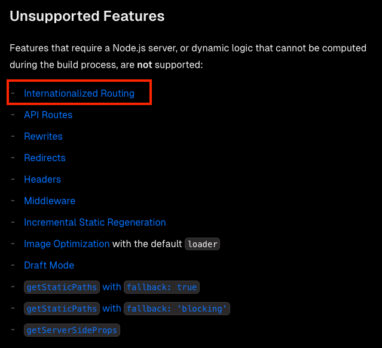
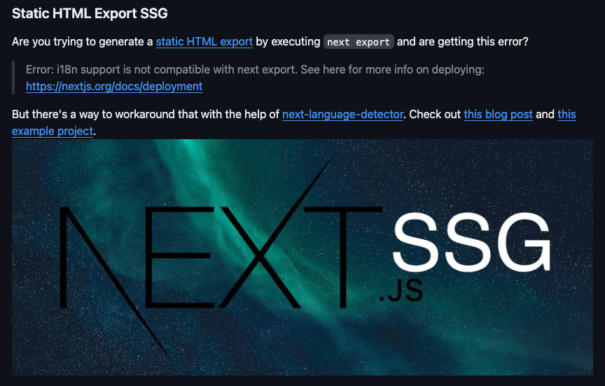
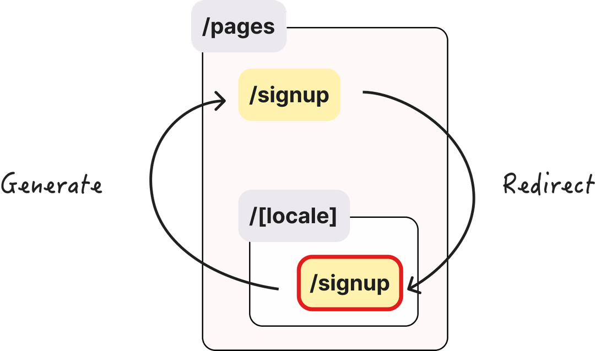
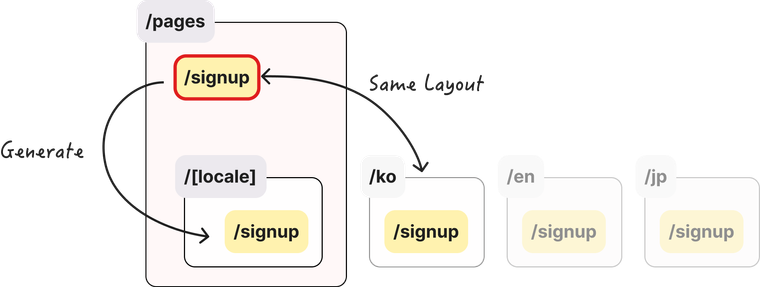

## 0. 배경

현업에서 서버가 필요하지 않은 페이지의 경우, 서버 관리와 비용을 최소화하기 위해
`Next.js의 Static Exports` 를 이용하여 `S3`를 이용한 **정적 페이지 배포 방식을 채택하였다.**

하지만, `next-i18next`를 이용한 국제화 라우팅은 Node.js 서버를 통해 처리된다.

_정적 파일 배포 시 지원하지 않는 기능 “국제화 라우팅”_

> 즉, 정적 배포 시에는 국제화 라우팅 기능을 사용할 수가 없다.
> 그러면.. 국제화는 어떻게 진행하지?

<br />
<br />

## 1. 국제화 라우팅 직접 구현

불행 중 다행히도, [next-i18n-next 에서는 이 블로그를 참고하여 직접 구현하는 것을 제안한다.](https://github.com/i18next/next-i18next?tab=readme-ov-file#static-html-export-ssg)

_아.. 지원 안하니까 포스팅 보고 직접 해라.. ㅇㅋ_

친절한 포스팅 덕분에 다음과 같은 순서를 거쳐 작업을 진행했다.

1. `next-i18next`, `next-language-detector` 설치
2. `/[locale]` 하위로 모든 pages 이동
3. 추출한 언어 JSON `public/locales/` 하위로 `ko`, `en` 추가
4. 동적 라우트를 위한 js 추가 샘플 코드
5. app, document 세팅
6. redirect 로직 추가

예시 코드는 모두 `js` 로 되어있었기 때문에 `@ts-ignore` , `eslint-disabled` 처리하고 기능 동작 자체에만 집중하여 마무리했다.

_국제화 라우팅 페이지 생성 과정_

첫번째 PR에서 다음 해야할 일을 다음과 같이 정리했다.

1. `ts-ignore` 처리 제거
2. `js -> ts` 가능한지 확인 (현재 lint 모두 무시)
3. 국제화용 `Link Component` 추가 네이밍 변경
4. `리다이렉트용 js 자동 생성 쉘 스크립트` 추가
5. `NEXT__DATA 기반 locale` 처리

<br />
<br />

## 2. TS 환경에 맞게 코드 변경

두번째 PR에서 정상적으로 동작하는 `js` 파일을 안전하게 관리할 수 있는 `ts` 코드로 변경하는 작업을 거쳤다.

1. ~~ts-ignore 처리 제거~~ -> `완료`
2. ~~js -> ts 가능한지 확인~~ -> `완료 - /lib 하위 ts 변경`
3. ~~국제화용 Link Component 추가 네이밍 변경~~ -> `완료 - LocaleLink`
4. ~~리다이렉트용 js 자동 생성 스크립트 추가~~ -> `완료 (/locale 하위 전부 Redirect 파일 생성)`
5. ~~NEXT\_\_DATA 기반 locale 처리~~ -> `완료`

<br />
<br />

## 3. 절대 경로 제거

라우팅 스크립트에서 편하게 설정하기 위해서 baseUrl을 설정하여 절대경로로 모듈을 import 하는 형식으로 설정했었다.

> as-is: import { Sample } from ‘../../components/Sample’;  
> to-be: import { Sample } from ‘@/components/Sample’;

하지만, **불행히도 모노레포에서 절대 경로를 사용하면 타입이 추론되지 않는 이슈가 있었다.. (ts 함수 한정)**

이로 인해 절대 경로 방식을 사용하지 않고, 기존 방식인 상대 경로를 이용한 import 방식을 유지하되 Redirect 로직은 현재 디렉토리 위치를 이용하여 제거해주는 스크립트를 추가하였다.

<br />
<br />

## 4. Config 타입 선언

`next-18next.config.js` 모듈 설정을 불러오면서 생기는 `implicit any type` eslint 에러를 해결하기 위해 `next-i18next.config.d.ts` 타입을 선언해주었다.

```ts
declare module "next-i18next.config" {
  export const i18n: {
    defaultLocale: string;
    locales: string[];
  };
}
```

이렇게 끝날 줄 알았다..

<br />
<br />

## 5. Default 페이지 경로 변경

원래는 `locale prefix`가 붙지 않는 페이지는 Redirect 컴포넌트를 이용하여  
**강제로 prefix 페이지로 이동시키도록 처리**하였다.

> https://www.sample.com/signup → locale 설정에 맞춰
> https://www.sample.com/ko/signup

하지만, 내부 논의 끝에 `locale prefix`가 없으면 `ko`와 동일한 페이지가 보이도록 처리하는 방향으로 수정됐다.
**이유는 기존 경로의 SEO를 유지하지 위해서였다. (너무나도 강력)**

따라서, 리다이렉트 로직을 제거하고 무조건 ko 와 동일한 페이지가 보이도록 처리하기 위해 쉘 스크립트를 수정했다.

```ts
// 수정 전 (기존 블로그 포스팅과 유사)
// packages/auth/src/pages/signup/index.tsx
import { Redirect } from "./../../lib/redirect";

export default Redirect;


// 수정 후
// packages/auth/src/pages/[locale]/signup/index.tsx 레이아웃과 동일
// packages/auth/src/pages/signup/index.tsx
import { useTranslation } from "next-i18next";

import LocaleLink from "../../components/LocaleLink/LocaleLink";
import { getStaticPaths, makeStaticProps } from "../../lib/getStatic";

const getStaticProps = makeStaticProps(["signup"]);
export { getStaticPaths, getStaticProps };

export default function SignUpPage() {
const { t } = useTranslation("signup");

return (
  <div>
    <Title order={1}>{t("title")}</Title>
    <Text size="md" color="gray.9" weight={500}>
      인프런 계정으로 로그인할 수 있어요.
    </Text>
    <LocaleLink href="/signin">Link Test</LocaleLink>
    // ...
  </div>
  );
}
```

<br />
<br />

### 6. 페이지 생성 경로 변경

기존 로직은 페이지 생성 시 `/[locale]` 내에서 page를 생성하도록 권장했다.

하지만 redirect 방식이 변경되면서 작업에 불편함을 느낀다는 피드백을 받아,
`/pages` 하위에 `router page`를 추가하면, **빌드 시 자동으로 `/[locale]` 폴더가 generate 되도록 수정하였다.**

_국제화 라우팅 페이지 생성 과정 (변경 후)_

<br />
<br />

## 7. README 작성

진짜 마무리.

작업 방식을 팀 내에 공유하고 이에 맞춰 `README`를 작성했다.
또한 다국어 JSON 파일 관리를 위한 `컨벤션`에 대해서도 간략하게 정리해뒀다.

즉, 현재 이 패키지 같은 경우에는 JSON 파일만 추가하면 다국어를 지원하는 상태이다.

<br />
<br />

## 8. 이후 추가 작업 (예정)

### 라이브러리화

환경 세팅을 위한 보일러 플레이트 코드가 다수 존재한다.

이를 라이브러리화해서 팀 내에서 손쉽게 사용하는 방식을 고안하고 있다.

### JSON 검사

`locale` 별로 JSON에 동일한 프로퍼티가 존재하는지를 검사하는 테스트 기능을 추가하면 좋겠단 생각이 들었다.

현재는 휴먼 에러로 인해 언어 변경을 놓칠 수 있는 상태이다.

<br />
<br />

## 9. 참고

- [Deploying: Static Exports](https://nextjs.org/docs/pages/building-your-application/deploying/static-exports)
- [GitHub - i18next/next-i18next: The easiest way to translate your NextJs apps.](https://github.com/i18next/next-i18next?tab=readme-ov-file#static-html-export-ssg)
- [dev-blog/JavaScript/static-html-export-i18n.md at master · yeonjuan/dev-blog](https://github.com/yeonjuan/dev-blog/blob/master/JavaScript/static-html-export-i18n.md)
